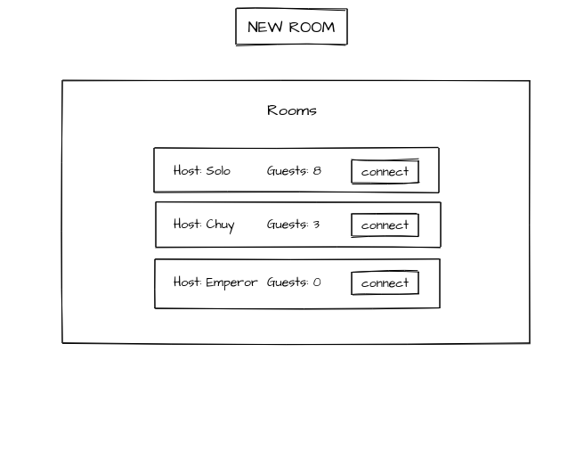
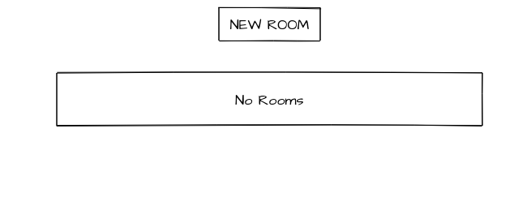
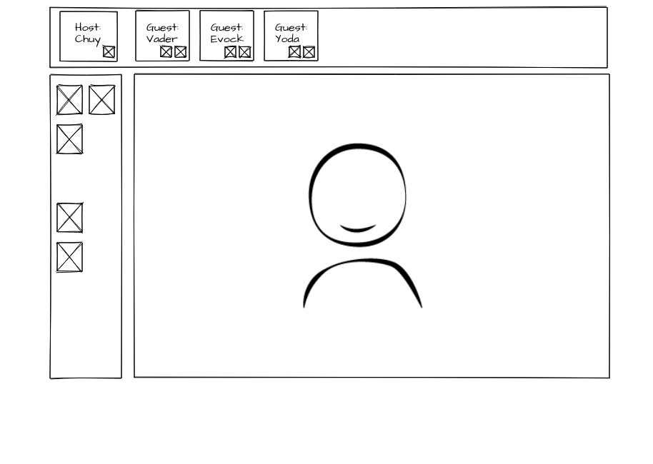

# Техническое задание проекта.

## Общее описание:

Проект представляет из себя веб приложение, для кооперативного рисования. Позволяет пользователю создавать комнаты для рисования, к которым могут подключаться другие участники. 

#### Host
Создатель комнаты(хост) может добавлять\выгонять участников из комнаты, давать\отбирать у них права на внесение изменений, сохранять результат на сервере. 

#### Guest
Участник присоединившийся к уже существующей комнате(гость) не может вносить изменения до предоставления ему таковых прав хостом. При сохранении результата хостом, гость может скачать результат с сервера себе.

## Функционал:

Стартовый экран представляет из себя список уже существующих комнат и форму для создания новой. 

- При клике на существующей комнате к ней можно подключиться. Появляется интерфейс редактора и список участников.

- При клике на кнопку формы "создать комнату", создается комната, в которой создающий её пользователь является хостом.

- При выходе из комнаты всех участников, комната удаляется. Хост может удалить комнату в любой момент.

Сам редактор представляет из себя canvas элемент, с возможностью редактирования его несколькими пользователями. Данную возможность реализовать с помощью WebSocket. При добавлении изменений на холсте, последние действия сохраняются в список и передаются на сервер, откуда их могу видеть остальные участники. При первом подключении к комнате, участнику передаются все действия над холстом с момента его создания. Остальные участники получают только последние изменения.

## Внешнее представление:

#### Стартовый экран:

1. Кнопка, при нажатии на которую появляется поп ап с формой ввода имени, пароля(если необходимо), дополнительных параметров, при клике на submit, комната с пользователем в качестве хоста создается.

2. Список комнат. На сервер посылается запрос, в ответ приходит массив объектов с ключами в виде имени хоста и количества гостей. В зависимости от ответа создается список комнат. При клике на комнату происходит подключение к ней.

При отсутствии созданных комнат выводится соответствующее сообщение

#### Экран редактора:

1. Верхняя панель с именем хоста и пользователей. Хост на ней может взаимодействовать с пользователями(добавлять, удалать права, выгонять гостя, удалять комнату). Гости могут на ней видеть свои права.

2. Боковая панель с возможностями редактора. Геометрические фигуры, ластик, выбор цвета, различные инструменты.

3. Центральная область - холст. Участник с правами рисования может вносить изменения на холст. Последние изменения отсылаются по ws, и их получают остальные участники.

